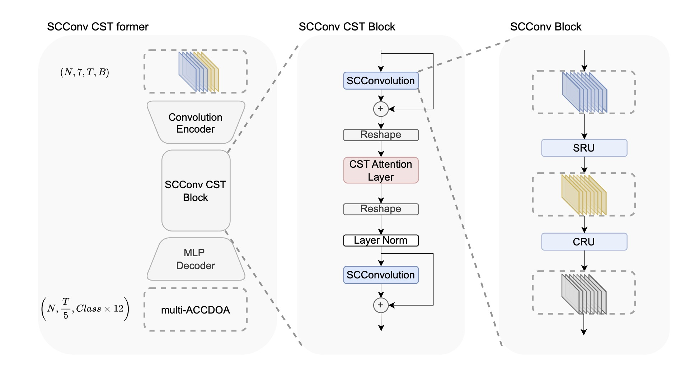

# Enhancing 1-Second SELD Performance with Filter Bank Analysis and SCConv Integration in CST-Former

## Introduction

This repository contains the code and resources for our paper:

**"Enhancing 1-Second SELD Performance with Filter Bank Analysis and SCConv Integration in CST-Former"**

In this work, we address the limitations of current Sound Event Localization and Detection (SELD) systems in handling short time segments (specifically 1-second windows). This is crucial for real-world applications requiring low-latency and fine temporal resolution. We establish a new baseline for SELD performance on 1-second segments. 

Our key contributions are:

- **Establishing SELD performance on 1-second segments**: Providing a new benchmark for short-segment analysis in SELD tasks.
- **Comparative analysis of filter banks**: Systematically comparing Bark, Mel, and Gammatone filter banks for audio feature extraction, demonstrating that Gammatone filters achieve the highest overall accuracy.
- **Integration of SCConv modules into CST-Former**: Replacing convolutional components in the CST block with the SCConv module, yielding measurable F-score gains and enhancing spatial and channel feature representation. The figure shows the model architecture. 

## Code Outline

The repository is organized as follows:

<!-- - `src/`: Source code for the SELD system.
  - `models/`: Contains model architectures including CST-Former and SCConv modules.
  - `data/`: Data loading and preprocessing scripts.
  - `utils/`: Utility functions for training, evaluation, and logging.
- `configs/`: Configuration files for experiments.
- `scripts/`: Shell scripts for running training and inference.
- `requirements.txt`: List of Python dependencies.
- `README.md`: Project documentation. -->
- `cls_dataset/`:
    - `cls_dataset.py`: PyTorch Dataset implementation for training procedure, aims to accelerate the trainning process.
- `models/`: source code for different models.
    - `architecture/`: source code for CST-former and SCConv CST former
    - `baseline_model.py`: source code for SELDnet
    - `conformer.py`:source code for Conv-Conformer
- `parameters.py` script consists of all the training, model, and feature configurations. One can add new configurations for feature extracion and model architecture. If a user wants to change some parameters or use a new configuration, they have to create a sub-task with unique id here. Check code for examples.
- `batch_feature_extraction.py` is a standalone wrapper script, that extracts the features, labels, and normalizes the training and test split features for a given dataset. **Make sure you update the location of the downloaded datasets in parameters.py before.**
- The `cls_compute_seld_results.py` script computes the metrics results on your DCASE output format files. 
- The `cls_data_generator.py` script provides feature + label data in generator mode for validation and test.
- The `cls_feature_class.py` script has routines for labels creation, features extraction and normalization. Filter bank options are use as an attribute of this class.
- The `cls_vid_features.py` script extracts video features for the audio-visual task from a pretrained ResNet model. Our system donnot implement audio-visual track.
- The `criterions.py` encompasses some custome loss functions and multi-accdoa 
<!-- - The `seldnet_model.py` script implements the SELDnet architecture. -->
- The `SELD_evaluation_metrics.py` script implements the metrics for joint evaluation of detection and localization.
- The `torch_run_vanilla.py` is a wrapper script that trains the model and calculates the metrics for each test dataset. The training stops when the F-score (check the paper) stops improving after 50 epochs of patience.
- `README.md`: Project documentation.

## Preparation

### Prerequisites

- **Operating System**: Linux recommended, codes are not being tested on Windows.
- **Python**: Version 3.11 or higher.
- **Anaconda**: Recommended for environment management.

### Installation Steps

1. **Clone the Repository**

   ```bash 
   git clone https://github.com/yourusername/short-time-seld.git #
   cd short-time-seld
   ```

2. **Create a Conda Environment**

   ```bash
   conda create -n seld python=3.11
   conda activate seld
   ```

3. **Install Dependencies**

   Install required Python packages using `pip`:

   ```bash
   pip install -r requirements.txt
   ```

   Alternatively, install using `conda`:

   ```bash
   conda install --file requirements.txt
   ```

## Data Preprocessing

### Dataset

We use the [[DCASE2024 Task 3] Synthetic SELD mixtures for baseline training](https://zenodo.org/records/10932241) dataset for our experiments.

### Steps

1. **Download the Dataset**

   Download the development and evaluation datasets from the DCASE challenge website and place them in the `data/` directory. Set the parameter: datasets_dir_dic to add path for your dataset in `parameters.py`, so does the  parameter:feat_label_dir_dic which saves all your labels.npy and features.npy. 

   ```bash
   mkdir data
   # Instructions or script to download the dataset
   ```

2. **Generate new labels with fine resolution and Extract Audio Features**

   Run the preprocessing script to extract features using your argv number, for example:

   ```bash
   python batch_feature_extraction.py 1
   ```
   Typically, this will generate about 50G feature files for each filter when using default settings.

3. **Data Augmentation (Optional)**

   Apply data augmentation techniques if needed, unfortunately we do not implement augmetation.

## Training and Inference

### Training the Model

Train different models:

```bash
python train_torch_vanilla.py 1  
```


### Monitoring Training and Test 

The training and test metrics and losses will be put into the `results_audio/` folder, and each unique setting in `parameter.py` will generate a unique hash path to your process. So does the checkpoints to the `models_audio/`. You can also use TensorBoard to monitor training progress.

## Acknowledgements 
Most of our codes come from the DCASE2024 baseline system[1], and the CST-former model code come from the official implementation of CST-former[2]. And the code of SCConv directly comes from the unoffical implementation[3].


## References

- [1] https://github.com/partha2409/DCASE2024_seld_baseline
- [2] Shul Y, Choi J W. CST-Former: Transformer with Channel-Spectro-Temporal Attention for Sound Event Localization and Detection[C]//ICASSP 2024-2024 IEEE International Conference on Acoustics, Speech and Signal Processing (ICASSP). IEEE, 2024: 8686-8690.
- [3] https://github.com/cheng-haha/ScConv


## Contact

For any questions or assistance, please contact:

- **Name**: Silhouette
- **Email**: [zzh953928832@gmail.com]

---


# Enhancing 1-Second SELD Performance with Filter Bank Analysis and SCConv Integration in CST-Former

Thank you for your interest in our work!